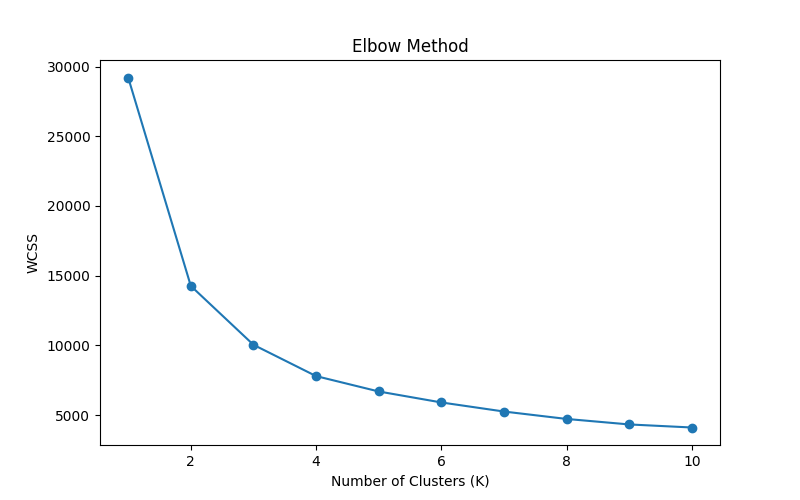
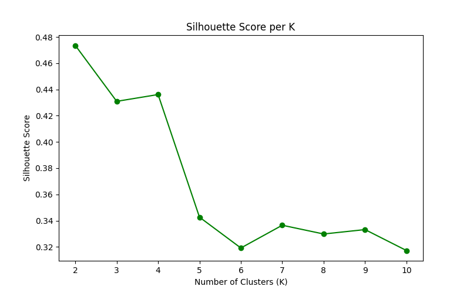
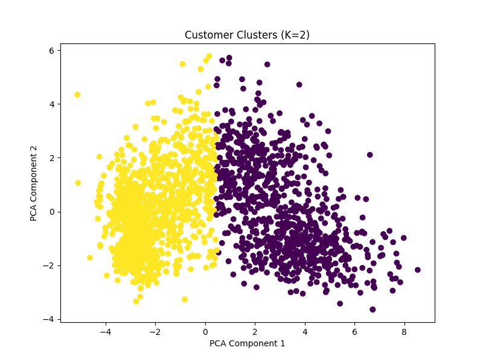
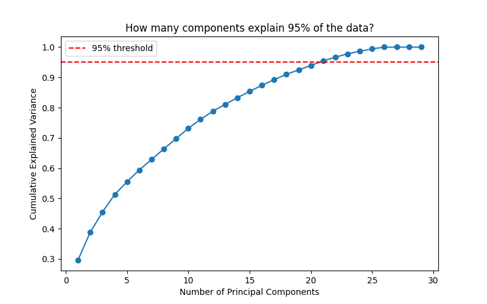

# Customer Segmentation Using PCA and K-Means Clustering

## 📌 Project Overview

This project applies **Unsupervised Learning** techniques to segment customers into meaningful groups based on their demographic, purchasing, and spending-related characteristics.

The project uses **Principal Component Analysis (PCA)** for dimensionality reduction and **K-Means Clustering** for customer segmentation.

The optimal number of clusters is evaluated using:

- Elbow Method
- Silhouette Score

The resulting clusters are then translated into practical **business personas** and actionable marketing strategies.

---

## 🎯 Objectives

The main objectives of this project are:

1. Preprocess and prepare customer data for clustering.
2. Perform feature engineering on customer information.
3. Standardize numerical features.
4. Reduce the high-dimensional feature space using PCA.
5. Determine a suitable number of clusters using the Elbow Method.
6. Mathematically evaluate cluster quality using the Silhouette Score.
7. Apply K-Means clustering to segment customers.
8. Visualize the resulting customer groups.
9. Translate clusters into meaningful business personas.
10. Suggest business strategies for each customer segment.

---

## 📊 Dataset

The project uses a customer sales dataset containing demographic, household, purchasing, and spending-related information.

The dataset includes information such as:

- Income
- Age
- Education
- Household characteristics
- Product spending
- Purchase behavior
- Customer relationship duration

The dataset is used for educational and analytical purposes.

---

## 🔧 Technologies Used

- Python
- Pandas
- NumPy
- Matplotlib
- Scikit-learn
- Jupyter Notebook / Google Colab

---

## 🧹 Data Preprocessing

The preprocessing stage includes:

- Handling missing values
- Removing selected outliers
- Removing unnecessary columns
- Converting customer dates
- Creating customer age
- Calculating customer lifetime in days
- Creating total spending
- Creating total purchases
- Creating total number of children
- Encoding categorical variables
- Selecting numerical features
- Standardizing the features using `StandardScaler`

---

## 📉 Principal Component Analysis (PCA)

PCA was used to reduce the dimensionality of the dataset before clustering.

The project reduced the high-dimensional numerical feature space to **3 principal components** for clustering and visualization.

The three components explain approximately **45.6% of the total variance** in the standardized data.

This reduction makes the data easier to visualize and allows the clustering process to operate in a lower-dimensional feature space.

---

## 📐 Determining the Number of Clusters

Two methods were used to evaluate the appropriate number of K-Means clusters.

### 1. Elbow Method

The Elbow Method evaluates the Within-Cluster Sum of Squares (WCSS) for different values of K.



### 2. Silhouette Score

The Silhouette Score measures how well-separated and internally consistent the clusters are.

The highest observed score was:

```text
K = 2
Silhouette Score = 0.474
```

Therefore, **K = 2** was selected for the final K-Means clustering.



---

## 🔬 Final Clustering

K-Means clustering was applied with:

```text
Number of clusters (K) = 2
```

The clustering was performed using the PCA-transformed data.



---

## 👥 Customer Personas

The resulting clusters were interpreted using customer-level characteristics.

### 🟢 Cluster 0 — High-Value Customers

Characteristics:

- Higher average income
- Much higher total spending
- More purchases
- Slightly fewer children on average

Business strategy:

- Offer premium products
- Provide loyalty rewards
- Use personalized offers
- Encourage repeat purchases through loyalty programs

---

### 🔵 Cluster 1 — Budget-Conscious Customers

Characteristics:

- Lower average income
- Much lower total spending
- Fewer purchases
- Higher average number of children

Business strategy:

- Offer discounts
- Promote budget-friendly products
- Provide family-oriented promotions
- Use bundle deals to encourage larger purchases

---

## 📈 PCA Variance Analysis

The project also examines cumulative explained variance to understand how much information is retained as the number of principal components increases.



---

## 💡 Key Findings

The analysis identified two major customer segments:

| Cluster | Persona | Main Characteristics |
|---|---|---|
| 0 | High-Value Customers | Higher income, spending, and purchase activity |
| 1 | Budget-Conscious Customers | Lower income, spending, and purchase activity |

The Silhouette Score supported **K = 2** as the strongest-separated solution among the tested values.

---

## 🚀 Business Applications

The identified segments can support:

- Customer targeting
- Personalized marketing
- Loyalty programs
- Discount strategies
- Product recommendations
- Customer retention
- Campaign planning

Different marketing strategies can therefore be designed for different customer groups instead of treating all customers identically.

---

## 📁 Project Structure

```text
customer-segmentation-kmeans/
│
├── Data_Science_Project_3.ipynb
├── customer_sales.csv
├── elbow_method.png
├── silhouette_scores.png
├── pca_variance.png
├── cluster_plot.png
└── README.md
```

---

## 👩‍💻 Author

**Sumiya Ahasan**

Data Science Intern

DecodeLabs

Computer Science & Engineering  
United International University (UIU)

---

## 📚 Learning Outcomes

Through this project, the following concepts were practiced:

- Unsupervised Learning
- Feature Engineering
- Feature Scaling
- Principal Component Analysis
- K-Means Clustering
- Elbow Method
- Silhouette Score
- Data Visualization
- Customer Segmentation
- Business Persona Development
